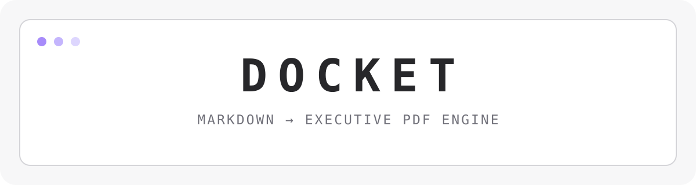

<div align="center">
  <picture>
    <source srcset="./assets/banner-dark.svg" media="(prefers-color-scheme: dark)" />
    <source srcset="./assets/banner-light.svg" media="(prefers-color-scheme: light)" />
    
  </picture>

  <p>
    
    
    
    
    <a href="./LICENSE"></a>
  </p>

  <p>
    <a href="#installation">Install</a>
    · <a href="#quick-start">Quick start</a>
    · <a href="./CHANGELOG.md">Changelog</a>
    · <a href="./SECURITY.md">Security</a>
  </p>
</div>

## Docket

Docket turns Markdown into polished, margin-safe executive PDFs. It combines a fast Bun/TypeScript CLI with a spacious OpenTUI workspace, live syntax highlighting, diagnostics, reusable themes, and a carefully isolated Puppeteer rendering pipeline with Shiki code styling.

Write in the terminal, open an existing document, or pipe Markdown from another command. Docket validates the document, renders it with the selected visual system, and publishes the PDF atomically so incomplete files are never left behind.

### Why Docket

- **Readable by default** — a maximized terminal editor with live syntax highlighting (VS Code, Catppuccin, One Dark, Dracula, Tokyo Night), gutter line numbering with error signs, scrollable sidebar, and clickable action buttons.
- **Publication-ready code blocks** — powered by `shiki` with VS Code `dark-plus` themes for crisp, beautiful code formatting in generated PDFs.
- **Cross-Platform Native Pickers & Path Presets** — 1-click native OS dialogs (macOS Finder, Windows OpenFileDialog/FolderBrowserDialog, Linux Zenity/KDialog) and authentic OS user folder resolution (`~/Downloads`, `~/Documents`) with universal tilde (`~`) expansion.
- **Safe to automate** — structured errors, signal handling, cancellation, browser recovery, bounded STDIN reads, and stable exit codes.
- **Built for real documents** — margin-safe A4 output, font readiness checks, tables, code blocks, callouts, Markdown links, and 1,000-line documents.

## Highlights

| Area | What you get |
| --- | --- |
| Markdown & Code | `markdown-it` parsing with `shiki` syntax highlighting, language badges, YAML frontmatter extraction, GitHub alerts/callouts (`> [!NOTE]`), multi-syntax page breaks (`\newpage`, `<!-- pagebreak -->`), tables, links, and safe HTML |
| Editor & Syntax | Real-time token highlighting across 6 themes, gutter line numbers, and inline error (`✖`) / warning (`▲`) markers |
| Diagnostics | Debounced linting with rule IDs, line numbers, severities, and actionable suggestions |
| PDF output | Puppeteer Chromium rendering with A4 sizing, margin-safe contract, font readiness checks, and atomic publication |
| Themes & Custom CSS | Independent PDF themes (`modern`, `executive`, `technical`, `legal`, `boardroom`, `minimal`), custom CSS overrides (`--css`), & TUI palettes |
| Watch Mode | Continuous compilation (`-w, --watch`) monitoring Markdown & CSS changes with debounced re-renders |
| TUI | Full-height canvas, scrollable sidebar, cross-platform native pickers (macOS/Windows/Linux), authentic Downloads/Docs presets, centered action buttons, `Ctrl+S` buffer saving, and responsive layouts |
| Reliability | Recoverable browser lifecycle, async cold-cache theme loading, cancellation, error cause preservation, and graceful crash handling |

## Installation

### macOS and Linux — release binary

The installer detects your OS and CPU architecture, downloads the matching release binary, verifies its SHA-256 checksum, and installs atomically into `~/.local/bin`.

```bash
curl -fsSL https://raw.githubusercontent.com/ezhil-003/docket/main/scripts/install.sh | bash
```

To install a pinned release or use a custom install directory:

```bash
curl -fsSL https://raw.githubusercontent.com/ezhil-003/docket/main/scripts/install.sh | bash -s -- --version v1.4.2 --dir "$HOME/.local/bin"
```

The installer supports `linux-x64`, `darwin-x64`, and `darwin-arm64`. It fails closed when the release checksum is missing or invalid.

### Windows — PowerShell

Run the installer directly in PowerShell:

```powershell
irm https://raw.githubusercontent.com/ezhil-003/docket/main/scripts/install.ps1 | iex
```

The installer verifies SHA-256 checksums and adds Docket to your user PATH without requiring administrator privileges.

### Bun global installation

If you prefer Bun to manage the CLI globally:

```bash
bun install --global github:ezhil-003/docket#main
docket --help
```

The release-binary path is recommended for end users; Bun global mode is useful for contributors and environments that already standardize on Bun.

### Development setup

```bash
git clone https://github.com/ezhil-003/docket.git
cd docket
bun install --frozen-lockfile
```

Requirements: Bun 1.x, Node.js 24+ for release/tooling workflows, and a Chromium-compatible environment for PDF generation. Dry-run HTML exports and the unit test suite do not require launching Chromium.

## Quick Start

### Interactive workspace

```bash
# From a checkout (the interactive UI is intentionally a development/runtime entry point)
bun run start
```

The startup screen lets you paste Markdown or open a file. The workspace places the document editor on the left and diagnostics/messages on the right. Buttons and shortcuts trigger the same actions. Installed release binaries expose the non-interactive `docket` CLI; run the TUI from a checkout with Bun.

### CLI conversion

```bash
# Convert a Markdown file
docket document.md --theme modern --output report.pdf

# Auto-recompile on save (watch mode)
docket document.md --watch

# Apply custom corporate styling and document title
docket report.md --css brand.css --title "Executive Review 2026"

# Read Markdown from STDIN
cat document.md | docket --paste --theme technical --output report.pdf

# Export the assembled HTML without starting Chromium
docket document.md --dry-run report.html
```

### Keyboard controls

| Shortcut | Action |
| --- | --- |
| `Ctrl+Enter` | Start the workspace or generate the PDF |
| `Ctrl+S` | Save current editor buffer to file |
| `Ctrl+O` | Open file mode |
| `Tab` | Move between controls |
| `Esc` | Interrupt rendering or leave the startup screen |
| `Ctrl+D` | Toggle diagnostics on compact terminals |
| `Ctrl+Q` | Quit |

## CLI Options

| Flag | Description | Default |
| --- | --- | --- |
| `-t, --theme <theme>` | `modern`, `executive`, `technical`, `legal`, `boardroom`, or `minimal` | `executive` |
| `-o, --output <file.pdf>` | Destination PDF path; directories receive `<title>.pdf` | Input name + `.pdf` |
| `--title <name>` | Override document title in PDF metadata | Frontmatter / H1 / filename |
| `--css <file.css>` | Apply custom CSS stylesheet or corporate tokens | — |
| `-w, --watch` | Watch input file and auto-recompile PDF on change | `false` |
| `-p, --paste` | Read Markdown from STDIN | `false` |
| `--force` | Bypass lint error gates | `false` |
| `--dry-run <out.html>` | Export intermediate HTML without browser rendering | — |
| `-v, --version` | Display Docket version | — |
| `-h, --help` | Display usage | — |

## Themes

| Theme | Character |
| --- | --- |
| `executive` | Navy and royal-blue boardroom styling |
| `modern` | Indigo/purple gradients and rounded accents |
| `technical` | Slate, cyan, and compact code-forward typography |
| `legal` | Formal serif body and traditional navy headers |
| `boardroom` | Warm charcoal with amber and bronze accents |
| `minimal` | Restrained monochrome presentation |

## Architecture

Docket keeps deterministic transformation logic separate from process and terminal effects:

```text
Markdown source
      │
      ▼
 Functional core: parse → lint → assemble
      │
      ▼
 Imperative shell: filesystem → Chromium → atomic PDF publish
      │
      ├── CLI adapter
      └── OpenTUI adapter
```

The codebase uses Functional Core / Imperative Shell, Ports and Adapters, dependency injection, reducer-driven TUI state, Strategy/Registry themes, and a staged conversion pipeline. The default browser manager is a lifecycle helper, not a general-purpose global service.

## Development Commands

```bash
bun install --frozen-lockfile
bun test                         # unit and pipeline tests
DOCKET_RUN_BROWSER_TESTS=1 bun test
bunx tsc --noEmit                # strict type-check
bun run build                    # compile the CLI binary
```

Release tags (`v*.*.*`) build native binaries for macOS Intel/Apple Silicon, Linux x64/ARM64, and Windows x64, then publish `SHA256SUMS` for installer verification. See [`.github/workflows/release.yml`](./.github/workflows/release.yml).

## Security

Markdown is treated as document input, not application code. Docket removes executable raw HTML content and disables JavaScript in the PDF page. Do not pass sensitive or untrusted documents to custom themes or external assets without reviewing your deployment policy.

Please report vulnerabilities privately according to [SECURITY.md](./SECURITY.md).

## Contributing

Bug reports, documentation improvements, themes, tests, and implementation contributions are welcome. Read [CONTRIBUTING.md](./CONTRIBUTING.md) and run the full verification commands before opening a pull request.

## License

MIT © Docket. See [LICENSE](./LICENSE).
